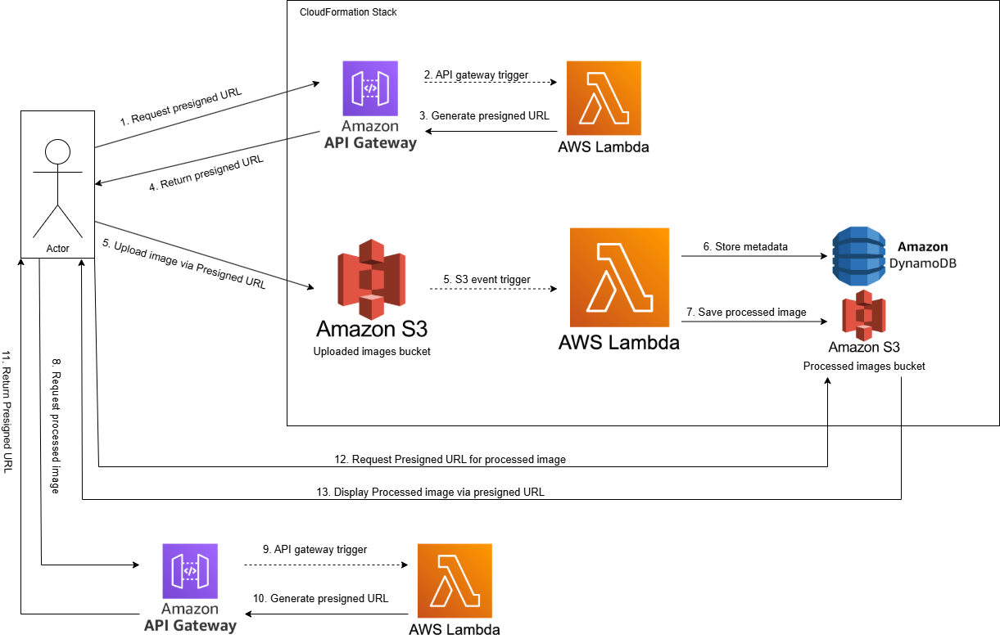

# Serverless Image Processing Application

This project implements a robust and scalable serverless application for processing images. It leverages AWS services to automatically resize and store images uploaded via a modern web interface.

## Key Features & Enhancements

*   **Modern UI:** A user-friendly web interface built with Bootstrap 5, featuring drag-and-drop functionality and real-time upload/processing feedback.
*   **Secure Uploads (AWS Best Practice):** Implements pre-signed S3 URLs for direct, secure, and efficient image uploads from the client to S3, bypassing the backend server for data transfer.
*   **In-Memory Image Processing:** The Lambda function processes images entirely in memory (`io.BytesIO`) to avoid common filesystem-related issues and improve performance.
*   **Robust Error Handling:** Enhanced error handling in the Lambda function, including URL decoding for S3 object keys with special characters.
*   **Automated Image Processing:** When an image is uploaded, an AWS Lambda function automatically resizes it and stores the processed version.
*   **Metadata Storage:** Image metadata (original/processed dimensions, sizes, etc.) is stored in Amazon DynamoDB.
*   **Serverless & Scalable:** Built on a serverless architecture, ensuring high scalability and cost-effectiveness (pay-per-use model).

## Architecture

The application follows a serverless, event-driven architecture:

1.  **Frontend (Browser):** The user interacts with a static HTML/JavaScript web page.
2.  **Pre-signed URL Generation (API Gateway + Lambda):** The frontend requests a secure, time-limited pre-signed URL from a dedicated API Gateway endpoint. A Lambda function generates this URL, granting temporary permission to upload directly to S3.
3.  **Direct Upload to S3:** The frontend uploads the image file directly to the designated S3 bucket using the pre-signed URL.
4.  **Image Processing Trigger (S3 Event):** The S3 upload event automatically triggers another AWS Lambda function.
5.  **In-Memory Image Processing:** This Lambda function downloads the image into memory, performs resizing (and can be extended for watermarking, etc.), and saves the processed image to an in-memory buffer.
6.  **Processed Image Storage:** The processed image is then uploaded from memory to a separate destination S3 bucket.
7.  **Metadata Storage:** Image metadata is stored in a DynamoDB table.
8.  **Processed Image Display:** The frontend polls for the processed image's availability and displays it using another pre-signed S3 URL generated by the backend.



## Key AWS Services Used

*   **Amazon S3:** Stores original and processed images. Configured with CORS for direct browser uploads.
*   **AWS Lambda:** Executes image processing and pre-signed URL generation logic.
*   **Amazon API Gateway:** Provides secure, public endpoints for generating pre-signed URLs.
*   **Amazon DynamoDB:** Stores image metadata.

## Getting Started

### Prerequisites

*   An AWS Account
*   AWS CLI configured with appropriate credentials
*   Node.js and npm installed (for CDK)
*   Python 3.11+ and `pip`
*   Docker (for Lambda asset bundling)

### Deployment

1.  **Clone the repository:**
    ```bash
    git clone <your-repo-url>
    cd Serverless-Image-Processing-with-S3-and-Lambda
    ```

2.  **Navigate to the CDK deployment directory:**
    ```bash
    cd cdk-deployment
    ```

3.  **Install Python dependencies:**
    ```bash
    python3 -m venv .venv
    source .venv/bin/activate
    pip install -r requirements.txt
    ```

4.  **Bootstrap CDK (if not already done):**
    ```bash
    cdk bootstrap aws://YOUR-AWS-ACCOUNT-ID/YOUR-AWS-REGION
    ```
    (Replace `YOUR-AWS-ACCOUNT-ID` and `YOUR-AWS-REGION` with your actual AWS account ID and region, e.g., `us-east-1`).

5.  **Deploy the stack:**
    ```bash
    cdk deploy
    ```
    This command will deploy all AWS resources, including S3 buckets, Lambda functions, API Gateway, and DynamoDB table. Note the `UploadApiUrl` output from the deployment.

### Running the UI

1.  **Open the UI:** Navigate to the `ui_app/templates/` directory.
2.  **Launch in Browser:** Open the `index.html` file directly in your web browser.

    *Note: The UI is now a static HTML/JavaScript application and does not require a local Flask server to run.*

## Usage

1.  Open the `index.html` file in your browser.
2.  Drag and drop an image, or click to select one.
3.  Click "Upload Image".
4.  The image will be uploaded directly to S3, processed by the Lambda, and the processed version will be displayed on the page.

## Contributing

Contributions are welcome! Please feel free to submit a pull request.